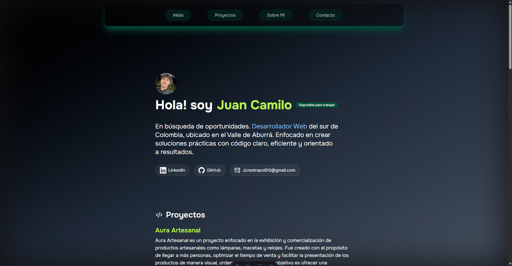
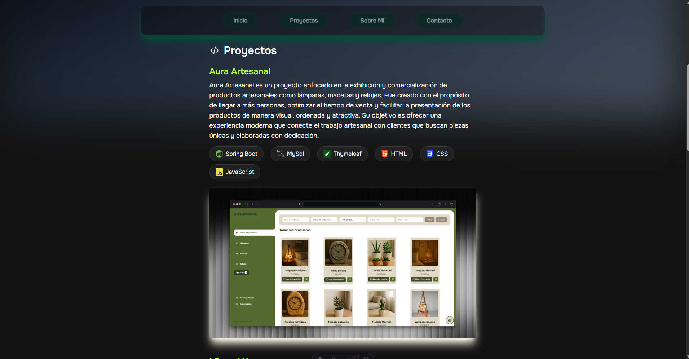
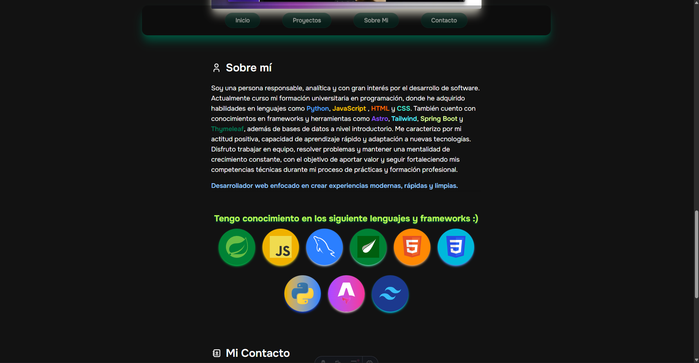
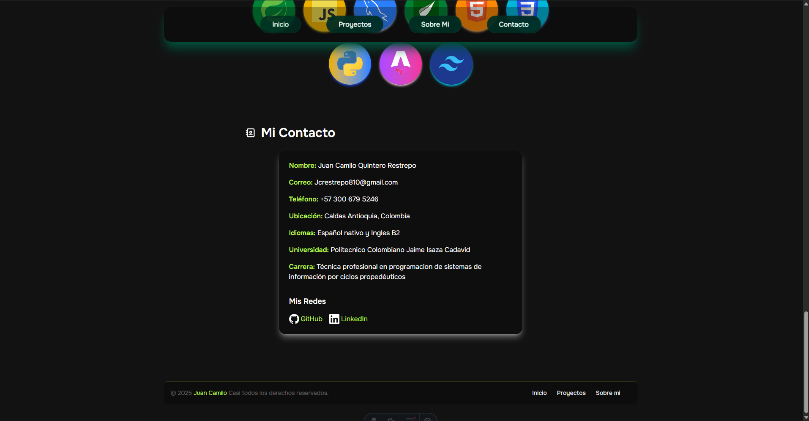

# Hola Bienvenidos al Portafolio de Juan Camilo, proyecto creado con los frameworks Astro y Tailwind.

# Este proyecto muestra mi resumen como programador web y mis proyectos realizados, añadiendo un poco de informacion sobre mi,
# y los lenguages de programacion que uso junto a diferentes frameworks y librerias que use en mis proyectos y que tengo conocimiento.

conoce mi portafolio en el siguiente enlace: https://porfolio-juan-camilo.netlify.app/

## Inicio 

## Proyectos

## Sobre mi

## Contacto

